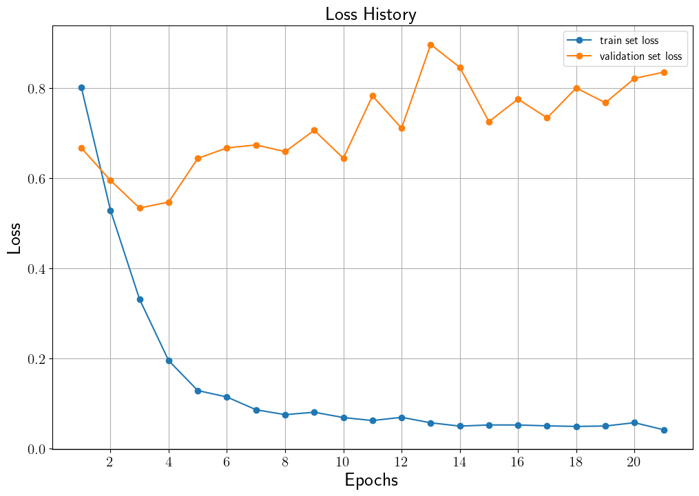
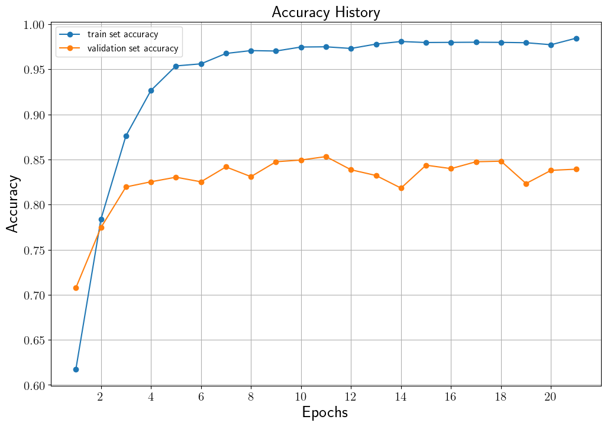
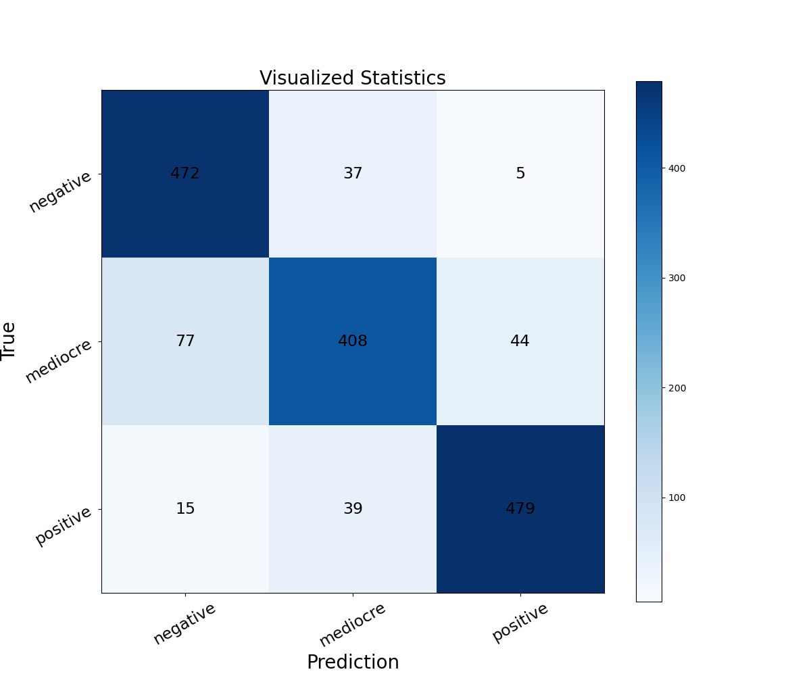

# Sentiment Classification BERT
한국어 버전의 설명은 [여기](./docs/README_ko.md)를 참고하시기 바랍니다.

## Introduction
This code fine-tunes a pre-trained BERT model using Google Play Store Apps review data to create a sentiment classification model for positive, neutral, and negative sentiments.
The BERT model used in this project is the "bert-base-uncased" pre-trained model from Hugging Face.
For an explanation of the BERT-based sentiment classification model and the use of pre-trained BERT, please refer to [Pre-trained BERT Fine-tuning을 통한 Google Play Store Apps 리뷰 감성 분류](https://ljm565.github.io/contents/bert3.html).
<br><br><br>

## Supported Models
### Pre-trained BERT
* Pre-trained BERT on Hugging Face.
<br><br><br>

## Supported Tokenizer
### Pre-trained BERT Tokenizer
* Pre-trained BERT tokenizer on Hugging Face.
<br><br><br>

## Base Dataset
* Base dataset for tutorial is [Google Play Store App review](https://curiousily.com/posts/sentiment-analysis-with-bert-and-hugging-face-using-pytorch-and-python/).
Ratings out of 5 stars are classified as follows: ratings below 3 stars are considered negative, ratings above 3 stars are considered positive, and a rating of 3 stars is considered neutral.
* Custom datasets can also be used by setting the path in the `config/config.yaml`.
However, implementing a custom dataloader may require additional coding work in `src/utils/data_utils.py` and `src/trainer/build.py`.
<br><br><br>

## Supported Devices
* CPU, GPU, multi-GPU (DDP), MPS (for Mac and torch>=1.12.0)
<br><br><br>

## Quick Start
```bash
python3 src/run/train.py --config config/config.yaml --mode train
```
<br><br>


## Project Tree
This repository is structured as follows.
```
├── configs                           <- Folder for storing config files
│   └── *.yaml
│
└── src      
    ├── models
    |   └── bert.py                   <- BERT model file
    |
    ├── run                   
    |   ├── sentiment_prediction.py   <- Prediction result example print code
    |   ├── train.py                  <- Training execution file
    |   ├── validation.py             <- Trained model evaulation execution file
    |   └── vis_statistics.py         <- Code that generates a confusion matrix for prediction results
    |
    ├── tools                   
    |   ├── tokenizers
    |   |    └── bert_tokenizer.py    <- BERT tokenizer file
    |   |
    |   ├── early_stopper.py          <- Early stopper class file
    |   ├── model_manager.py          
    |   └── training_logger.py        <- Training logger class file
    |
    ├── trainer                 
    |   ├── build.py                  <- Codes for initializing dataset, dataloader, etc.
    |   └── trainer.py                <- Class for training, evaluating, and calculating accuracy
    |
    └── uitls                   
        ├── __init__.py               <- File for initializing the logger, versioning, etc.
        ├── data_utils.py             <- File defining the custom dataset dataloader
        ├── filesys_utils.py       
        ├── func_utils.py       
        └── training_utils.py     
```
<br><br>


## Tutorials & Documentations
Please follow the steps below to train a BERT sentiment classification model.
1. [Getting Started](./docs/1_getting_started.md)
2. [Data Preparation](./docs/2_data_preparation.md)
3. [Training](./docs/3_trainig.md)
4. ETC
   * [Evaluation](./docs/4_model_evaluation.md)
   * [Confusion Matrix Visualization](./docs/5_confusion_matrix.md)
   * [Print Sentiment Prediction Results](./docs/6_pred_sentiment.md)

<br><br><br>


## Training Results
* ### Sentiment Classification BERT 모델 결과
    * Loss History<br>
    <br><br>

    * Accuracy History<br>
    <br><br>
    
    * 최종 Test Set Statistics<br>
        Validation set accuracy가 가장 높았던 11 epoch 모델을 test set에 적용한 결과<br><br>
        Acc: 0.86<br>
        ```
                      precision    recall  f1-score   support

            negative       0.84      0.92      0.88       514
            mediocre       0.84      0.77      0.81       529
            positive       0.91      0.90      0.90       533

            accuracy                           0.86      1576
           macro avg       0.86      0.86      0.86      1576
        weighted avg       0.86      0.86      0.86      1576
        ```
        <br><br>

    * 결과 샘플<br>
        ```
        # sample 1
        review: [CLS] i had paid once for this app and had login to it. now i have another mobile and want to use my acount on this device, but this app asket to pay first before login. should i pay each time i change my device? [SEP]
        gt    : negative
        pred  : negative


        # sample 2
        review: [CLS] i got this app to track my medication and it's perfect! i can set up how i want to take each medicine ( yes / no or quantity ), see the start date and adherence in the summary view, and even track side effects and effectiveness each day then see them in a chronological list in the sunmary. and the best part is that it's not tied to some medical database! added bonus : i can track real to - dos as well. overall, love this app! [SEP]
        gt    : positive
        pred  : positive


        # sample 3
        review: [CLS] great app [SEP]
        gt    : positive
        pred  : positive
        ```
    <br><br>


<br><br><br>
