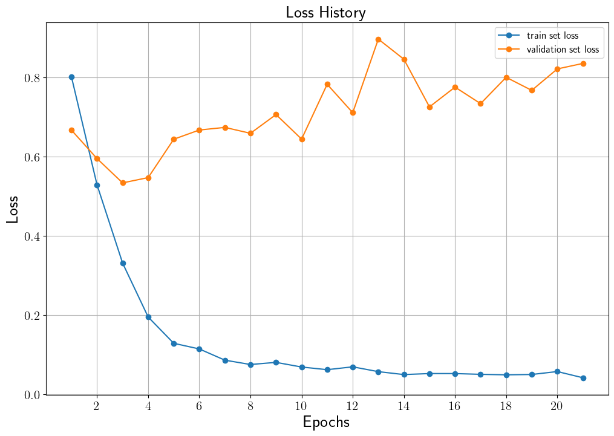

# Sentiment Classification BERT

## Introduction
본 코드는 Google Play Store Apps 리뷰 데이터 바탕으로 pre-trained BERT 모델을 fine-tuning하여 긍정, 보통, 부정 감성 분류 모델을 제작합니다.
본 프로젝트에 사용한 BERT 모델은 [Hugging Face BERT의 "bert-base-uncased" pre-trained 모델](https://huggingface.co/transformers/model_doc/bert)입니다.
BERT 기반 감성 분류 모델과 pre-trained BERT 사용에 대한 설명은 [Pre-trained BERT Fine-tuning을 통한 Google Play Store Apps 리뷰 감성 분류](https://ljm565.github.io/contents/bert3.html)를 참고하시기 바랍니다.
<br><br><br>

## Supported Models
### Pre-trained BERT
* Hugging Face의 pre-trained BERT 모델을 사용합니다.
<br><br><br>


## Supported Models
### Pre-trained BERT Tokenizer
* Hugging Face의 pre-trained BERT 토크나이저를 사용합니다.
<br><br><br>

## Base Dataset
* 실험으로 사용하는 데이터는 [Google Play Store App review](https://curiousily.com/posts/sentiment-analysis-with-bert-and-hugging-face-using-pytorch-and-python/) 데이터입니다. 5점 만점 평점 중, 3점 미만은 부정, 3점 초과는 긍정, 3점은 보통으로 분류하여 사용합니다.
* `config/config.yaml`에 학습 데이터의 경로를 설정하여 사용자가 가지고 있는 custom 데이터도 학습 가능합니다.
다만 `src/utils/data_utils.py`에 custom dataloader와 `src/trainr/build.py`에 추가 코드를 구현해야 합니다.
<br><br><br>

## Supported Devices
* CPU, GPU, multi-GPU (DDP), MPS (for Mac and torch>=1.12.0)
<br><br><br>

## Quick Start
```bash
python3 src/run/train.py --config config/config.yaml --mode train
```
<br><br>

## Project Tree
본 레포지토리는 아래와 같은 구조로 구성됩니다.
```
├── configs                           <- Config 파일들을 저장하는 폴더
│   └── *.yaml
│
└── src      
    ├── models
    |   └── bert.py                   <- BERT 모델 파일
    |
    ├── run                   
    |   ├── sentiment_prediction.py   <- 예측 결과 프린트 코드
    |   ├── train.py                  <- 학습 실행 파일
    |   ├── validation.py             <- 학습된 모델 평가 실행 파일
    |   └── vis_statistics.py         <- Confusion matrix 결과 실행 파일
    |
    ├── tools                   
    |   ├── tokenizers
    |   |    └── bert_tokenizer.py    <- BERT 토크나이저 파일
    |   |
    |   ├── early_stopper.py          <- Early stopper 클래스 파일
    |   ├── model_manager.py          
    |   └── training_logger.py        <- Training logger 클래스 파일
    |
    ├── trainer                 
    |   ├── build.py                  <- Dataset, dataloader 등을 정의하는 파일
    |   └── trainer.py                <- 학습, 평가, accuracy 계산 class 파일
    |
    └── uitls                   
        ├── __init__.py               <- Logger, 버전 등을 초기화 하는 파일
        ├── data_utils.py             <- Custom dataloader 파일
        ├── filesys_utils.py       
        ├── func_utils.py       
        └── training_utils.py     
```
<br><br>


## Tutorials & Documentations
BERT 감성 분류 모델 학습을 위해서 다음 과정을 따라주시기 바랍니다.
1. [Getting Started](./1_getting_started_ko.md)
2. [Data Preparation](./2_data_preparation_ko.md)
3. [Training](./3_trainig_ko.md)
4. ETC
   * [Evaluation](./4_model_evaluation_ko.md)
   * [Confusion Matrix Visualization](./5_confusion_matrix_ko.md)
   * [Print Sentiment Prediction Results](./6_pred_sentiment_ko.md)

<br><br><br>


## Training Results
### Sentiment Classification Results of the BERT
* Loss History<br>
<br><br>

* Accuracy History<br>
<br><br>

* Test Set Confusion Matrix<br>
    Validation set accuracy가 가장 높았던 11 epoch 모델을 test set에 적용한 결과<br><br>
    Acc: 0.86<br>
    ```
                    precision    recall  f1-score   support

        negative       0.84      0.92      0.88       514
        mediocre       0.84      0.77      0.81       529
        positive       0.91      0.90      0.90       533

        accuracy                           0.86      1576
        macro avg      0.86      0.86      0.86      1576
    weighted avg       0.86      0.86      0.86      1576
    ```
    <br><br>

    * Prediction Samples<br>
        ```
        # sample 1
        review: [CLS] i had paid once for this app and had login to it. now i have another mobile and want to use my acount on this device, but this app asket to pay first before login. should i pay each time i change my device? [SEP]
        gt    : negative
        pred  : negative


        # sample 2
        review: [CLS] i got this app to track my medication and it's perfect! i can set up how i want to take each medicine ( yes / no or quantity ), see the start date and adherence in the summary view, and even track side effects and effectiveness each day then see them in a chronological list in the sunmary. and the best part is that it's not tied to some medical database! added bonus : i can track real to - dos as well. overall, love this app! [SEP]
        gt    : positive
        pred  : positive


        # sample 3
        review: [CLS] great app [SEP]
        gt    : positive
        pred  : positive
        ```
    <br><br>

